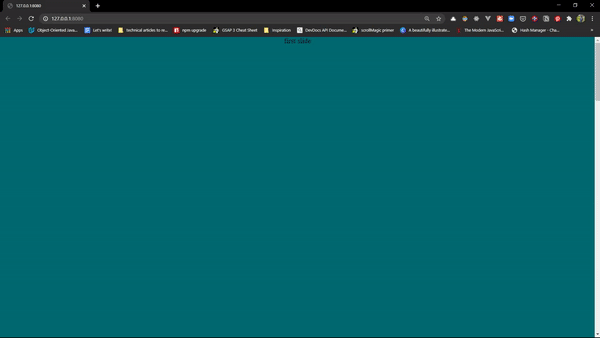

Currently learning [gsap](https://greensock.com/gsap/) and I tried implementing the little scroll triggered animation (as you can see below), in which I came across on [le-mugs](https://le-mugs.com/).

 / 
